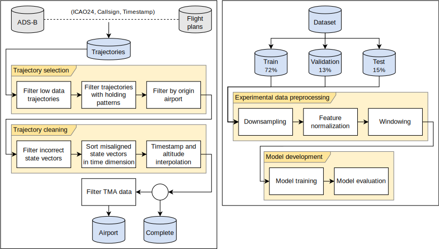
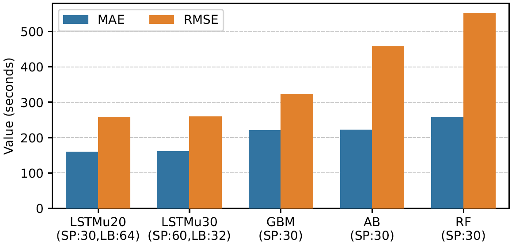
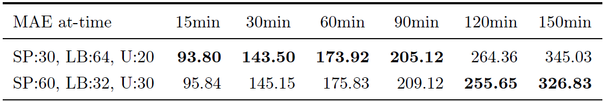
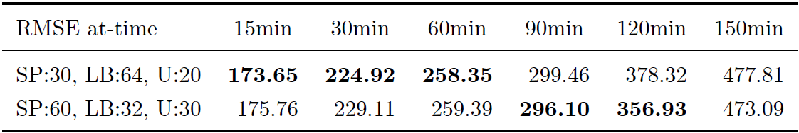
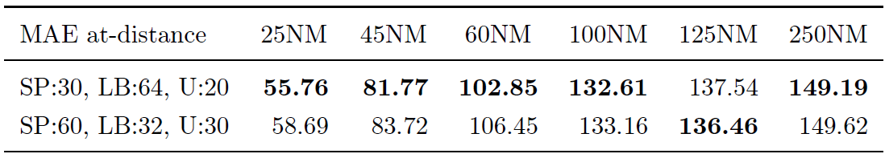
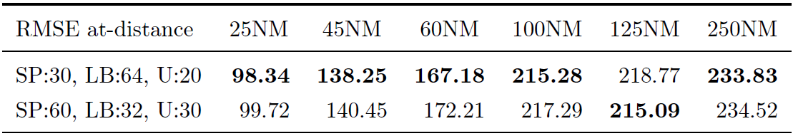

# A Deep Learning-Based Approach for Predicting In-Flight Estimated Time of Arrival

This repository contains the software materials associated with the paper:

**J. Silvestre, M. A. Martínez-Prieto, A. Bregon, P. C. Álvarez-Esteban**  
*A deep learning-based approach for predicting in-flight estimated time of arrival*  
Journal of Supercomputing, 2024.  
https://doi.org/10.1007/s11227-024-06060-6

---

## Abstract

Predictability is key for efficient and safe air traffic management. In particular, accurately estimating time of arrival for current passenger flights may help terminal controllers to plan ahead and optimize airport operations in terms of safety and resource allocation. While traditional physics-based simulations are still widely used, they are complex to model and often fail to include many factors affecting the progress of a flight. 

In this paper, we propose a deep learning approach based on LSTM that leverages the 4D trajectory of the flight and weather data at the destination airport, to accurately predict estimated time of arrival. We evaluate our model on flights arriving at Adolfo Suárez-Madrid Barajas airport (Spain), in the first three quarters of 2022, achieving a mean absolute error of 2.65 min over the entire flight and reporting competitive short- and long-term predictions at different spatial and temporal horizons.

---

## Overview of the Approach

We propose a global LSTM-based model for predicting the remaining time to arrival (RTA) of commercial flights at any point during the flight, leveraging:

- 4D surveillance trajectories (ADS-B),
- flight plan information,
- weather forecasts at the destination airport.

The model is evaluated on international flights arriving at Madrid-Barajas (LEMD), showing a mean absolute error of **2.65 minutes** over the entire flight.



---

## Main Results

### Global Performance

Our best configuration (SP=30s, LB=64, U=20) significantly outperforms state-of-the-art baselines such as GBM, RF and AB.


<figure>

<figcaption>Comparison of results between our LSTM-based models and other techniques from the state of the art. Units in seconds.</figcaption>
</figure>

### Performance at Different Horizons

The model provides accurate predictions both near the airport and at early stages of the flight.

**At-time metrics**
<figure>

<figcaption>MAE values at different times before arrival at the airport. Units in seconds.</figcaption>
</figure>

<figure>

<figcaption>RMSE values at different times before arrival at the airport. Units in squared seconds.</figcaption>
</figure>

**At-distance metrics**  

<figure>

<figcaption>MAE values at different distances to the airport. Units in seconds.</figcaption>
</figure>

<figure>

<figcaption>RMSE values at different distances to the airport. Units in squared seconds.</figcaption>
</figure>


---

## Repository Structure

The repository is organized as follows:

- `rtaUtils/`: Core implementation of preprocessing, models, training and evaluation.
- `notebooks/`: Reproducibility and analysis notebooks aligned with the paper sections.
- `docs/`: Additional documentation and figures.
- `requirements.txt`: Python dependencies.

A detailed description is available in [`docs/repository_structure.md`](docs/repository_structure.md).

---

## Data Availability and Licensing

Due to licensing restrictions, **datasets and trained models are not included** in this repository.

The experiments were conducted using:
- OpenSky ADS-B surveillance data,
- EUROCONTROL Network Manager flight plan data,
- TAF weather forecasts.

---

## Usage

This repository is intended to:
- document the methodology described in the paper,
- support reproducibility for researchers with access to equivalent data,
- serve as a reference implementation.

Typical workflow:
1. Generate trajectories and features.
2. Train LSTM or baseline models.
3. Evaluate performance at different temporal and spatial horizons.

Example notebooks are provided in the `notebooks/` directory.

---

## Citation

If you use this work, please cite:

```bibtex
@article{Silvestre2024RTA,
  title   = {A deep learning-based approach for predicting in-flight estimated time of arrival},
  author  = {Silvestre, Jorge and Martínez-Prieto, Miguel A. and Bregon, Anibal and Álvarez-Esteban, Pedro C.},
  journal = {Journal of Supercomputing},
  year    = {2024},
  doi     = {10.1007/s11227-024-06060-6}
}